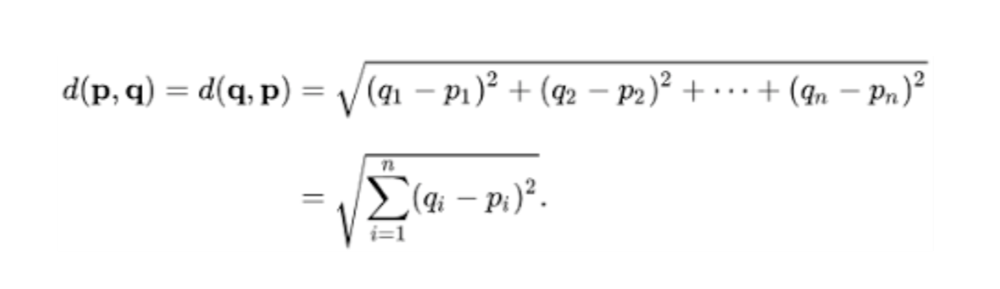
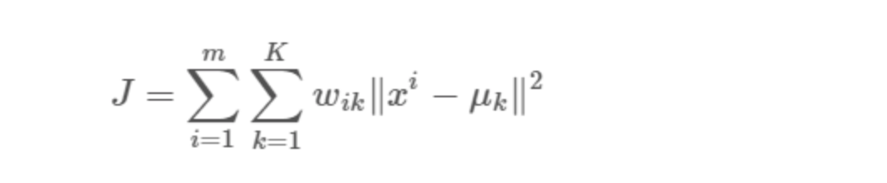
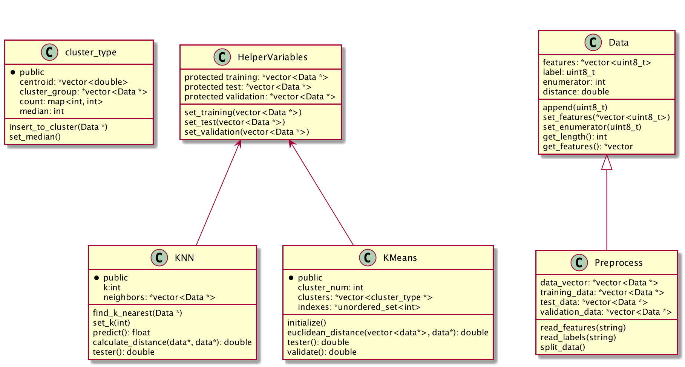

# ML-Algorithms-in-C++

This repo compares KNN and K-Means Machine Learning Algorithms which were implemented by using only standard templates in C++. The motivation behid of this project to implement the algorithms from strach to grasp better understanding of them and compare the results.

* _DATA_: The MNIST database of handwritten digits, available from this page, has a training set of 60,000 examples, and a test set of 10,000 examples. [Check the official webtise of the data](http://yann.lecun.com/exdb/mnist/)

__Keywords__: C++, Machine Learning, STL, Algorithms, Docker, Bash Script

 

## Algorithms:

* KNN: The k-nearest neighbors algorithm is a supervised classification algorithm. The first step in this algorithm to transform data points into feature vectors then finding the distance between the mathematical values of these points. 

    
    KNN runs this formula to compute the distance between each data point and the test data. It then finds the probability of these points being similar to the test data and classifies it based on which points share the highest probabilities.

* K-Means: The k-means algorithm is an unsupervised clustering algorithm. It takes unlabeled points and tries to group them into “k” number of clusters.

    

## Performance:

-> The data structures used is mainly vector, set, map. The vector contains pointer to data which data is commonly used and copied over each algorithm in order to boost the performance. 

-> On the implementation of this project KNN algorithm runs in a loop to find the best k and performs about 97% accurancy. K-Means algorithm also runs in a loop in order to find the best k and performs worse than KNN. Running time comperension is that KNN is very slower compared to K-Means. It would be interesting to implement them with CUDA and check the performance. 

## How to Run

### Without Docker

* clone the repo
* cd to directory
* run `chmod +x run.sh && ./run.sh`
* Note:

    This will work only with linux or Mac, and requires clang installed
### With Docker

* cd docker
* docker-compose build
* docker-compose run ml-runner bash
* run `chmod +x run.sh && ./run.sh`
* It will prompt for the algorithm name 

### Class Diagram

Links for Help:

* [K-Means Clusting](https://towardsdatascience.com/understanding-k-means-clustering-in-machine-learning-6a6e67336aa1)
* [K-Nearest Neighbors Algorithm](https://towardsdatascience.com/machine-learning-basics-with-the-k-nearest-neighbors-algorithm-6a6e71d01761)
* [Clang](https://clang.llvm.org)
* [Docker](https://docker-curriculum.com)
* [STL](http://www.cplusplus.com/reference/stl/)